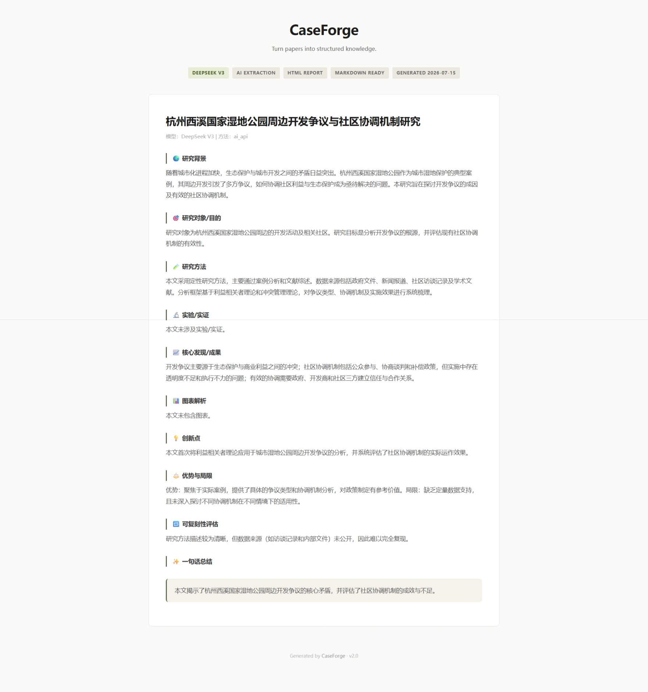

# ⚒️ CaseForge

> **Don't just read papers. Build knowledge from them.**

*An extensible AI workflow for extracting structured case studies from academic literature.*

## Who is this for?

If you read **3+ papers a week** and want to turn them into **searchable, reusable knowledge assets** — CaseForge is built for you.

---

## Why CaseForge?

Most AI tools **summarize** papers.

CaseForge **transforms** papers into structured knowledge that can be searched, compared, and reused.

Instead of asking:
> "What is this paper about?"

CaseForge asks:
> "What knowledge can we extract from this paper?"

---

## Philosophy

CaseForge is not another paper chatbot.

It is a **workflow engine** for turning academic literature into structured knowledge.

Small. Simple. Extensible. Reusable.

---

## What It Does

```
  📄 Paper (PDF / TXT / MD)
        │
        ▼
  📖 Reader      ← pdfplumber / markitdown
        │
        ▼
  🧠 AI Extract  ← 10-field deep extraction
        │
        ▼
  📊 Export      ← HTML / Markdown / JSON / Word
```

---

## Demo



```bash
python main.py --demo
```

---

## Quick Start

```bash
git clone https://github.com/nowornever17/CaseForge.git
cd CaseForge
pip install -r requirements.txt
cp config.example.py config.py     # add any one API key
python main.py --demo
```

---

## Features

- ✅ 8-field structured case extraction
- ✅ Export to HTML / Markdown / JSON / Word
- ✅ Prompt-driven workflow (swap disciplines without changing code)
- ✅ Multi-provider LLM support (5 APIs, including free tier)
- ✅ Local TF-IDF fallback when API fails
- ✅ Dedup cache (never pay twice for the same paper)
- ✅ Academic search (Semantic Scholar / OpenAlex / CORE)

---

## Example Output

```markdown
## 案例标题

🌍 研究背景
城市湿地公园面临生态保护与开发的结构性张力...

🎯 研究对象/目的
分析杭州西溪湿地公园的开发争议与协调机制...

🧪 研究方法
案例研究法，数据来源包括政策文件、生态监测数据...

📈 核心发现
围栏式保护不可持续，需利益共享+多主体协商...

💡 创新点
将社区协调机制与规划管控相结合进行系统分析...

✨ 一句话总结
社区利益共享与协商机制需前置到规划阶段。
```

---

## Architecture

```
prompts/           ← Discipline-specific extraction templates
    │
    ▼
api_client.py      ← Unified interface for 5 LLM providers
    │
    ▼
exporters.py       ← HTML / Markdown / JSON / Word output
    │
    ▼
search.py          ← Semantic Scholar / OpenAlex / CORE
```

---

## Extensible by Design

Add a new discipline **without touching any code**:

```
prompts/
├── urban_design.md    ← default
├── education.md       ← contributed
├── medicine.md        ← coming soon
└── law.md             ← coming soon
```

---

## Roadmap

- ✅ Markdown / JSON / Word / HTML export
- ✅ Multi-provider LLM support
- ✅ Prompt plugin system
- ✅ Academic search (3 databases)
- □ Prompt marketplace
- □ MCP / Skills integration
- □ Web UI

---

## Contributing

We welcome contributions — especially:

- **Prompt templates** for new disciplines
- **Readers** for new input formats
- **Exporters** for new output formats
- **Tests** and documentation

See [CONTRIBUTING.md](./CONTRIBUTING.md).

---

[MIT License](./LICENSE) · [Changelog](./CHANGELOG.md)
